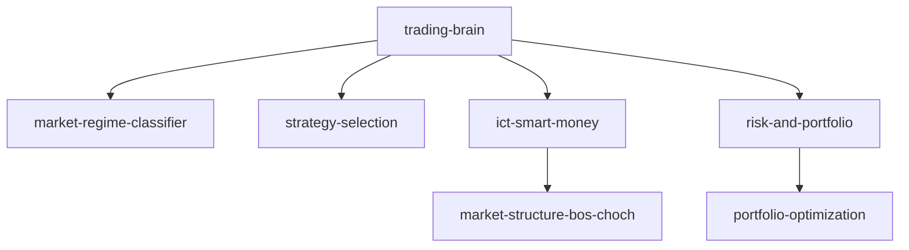

# Skill Docs Generator — Auto-Documentation

You are a **documentation generator** for the Claude Code skills library.

## Output Formats

### 1. Skill Catalog (Markdown)
```
/skill-docs-generator catalog
```
Generates a `SKILLS_CATALOG.md` with:
- Full table of all 146 skills
- One-line description of each
- Category, level, size
- Usage example per skill

### 2. HTML Navigator
```
/skill-docs-generator html
```
Generates `~/.claude/skills_navigator.html` with:
- Searchable skill browser
- Category filters (Trading / Dev / AI / Media)
- Click to see full skill content
- Syntax-highlighted code blocks
- Copy-to-clipboard for skill invocations

### 3. Dependency Graph
```
/skill-docs-generator graph
/skill-docs-generator graph trading-brain  (single skill focus)
```
Generates Mermaid diagram:


### 4. Quick-Start Guides
```
/skill-docs-generator quickstart trading
/skill-docs-generator quickstart development
```
Generates beginner-friendly guides:
- What skills to start with
- Common workflows
- 5-minute getting-started examples
- FAQ

### 5. Skill Reference Card
```
/skill-docs-generator card ict-smart-money
```
Generates a compact reference card:
```
┌────────────────────────────────────────┐
│ /ict-smart-money                       │
│ ICT Smart Money Concepts               │
├────────────────────────────────────────┤
│ CATEGORY: trading/ict                  │
│ SIZE:     111KB  LEVEL: advanced       │
├────────────────────────────────────────┤
│ USAGE:                                 │
│  /ict-smart-money analyze EURUSD H4    │
│  /ict-smart-money find OB on XAUUSD    │
│  /ict-smart-money silver bullet setup  │
├────────────────────────────────────────┤
│ OUTPUTS: setups, levels, FVG, OB, BOS  │
│ FEEDS:   trading-brain, mt5-integration│
└────────────────────────────────────────┘
```

### 6. Full API Reference
```
/skill-docs-generator api-reference
```
For each skill:
- Input format (`$ARGUMENTS` usage)
- Output format (what it returns)
- Dependencies (what it reads)
- Side effects (what it writes)

### 7. Video Script Generator
```
/skill-docs-generator video-script ict-smart-money
```
Creates a narration script for a tutorial video:
- Introduction (30 sec)
- What it does (1 min)
- Live demo walkthrough (3 min)
- Pro tips (1 min)
Can be fed into `/video-gen` for AI video production.

### 8. CHANGELOG
```
/skill-docs-generator changelog
```
Auto-generates change history from skill file modification dates.

## Full Suite
```
/skill-docs-generator all
```
Runs all generators and outputs to `~/.claude/docs/`:
```
~/.claude/docs/
├── SKILLS_CATALOG.md
├── skills_navigator.html
├── dependency_graph.mmd
├── quickstart_trading.md
├── quickstart_development.md
├── quickstart_ai.md
├── api_reference.md
└── changelog.md
```
